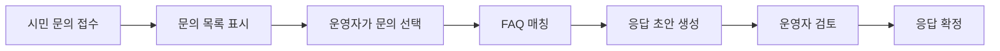
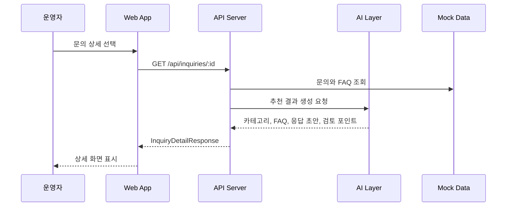
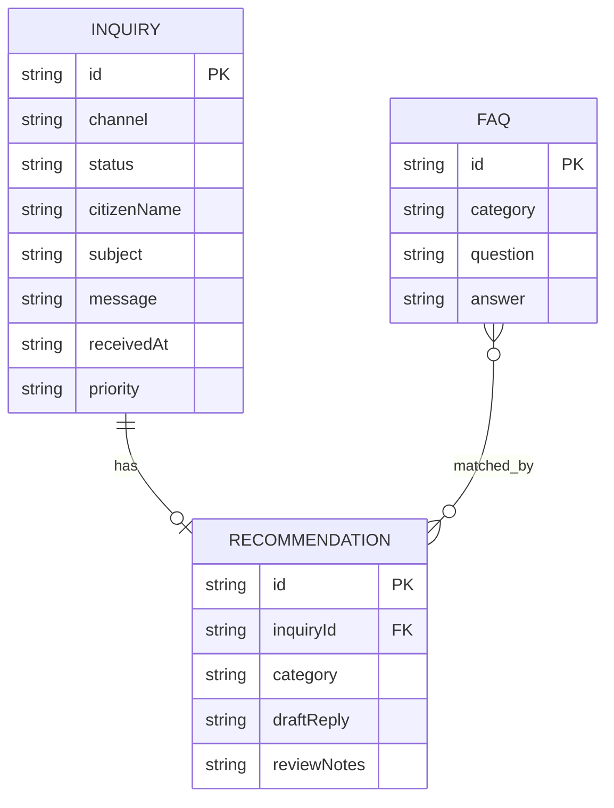
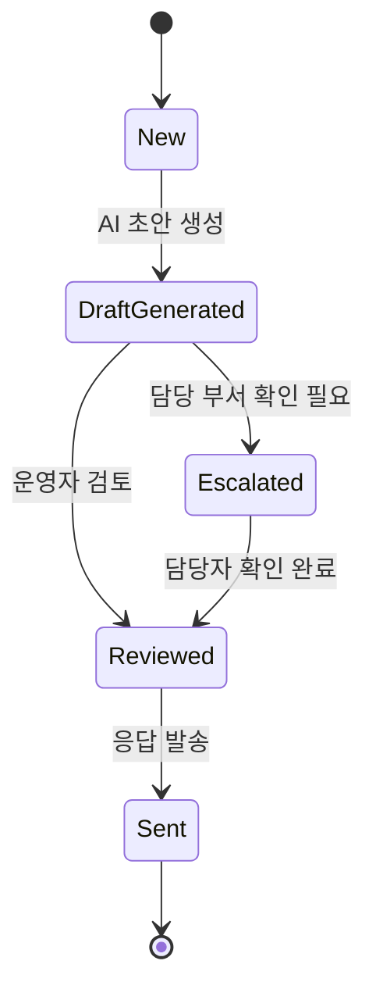

# Mermaid Diagram Guide

## 목적

이 문서는 Claude Desktop / Claude Code와 함께 PRD와 설계 문서를 개발 가능한 구조로 바꿀 때 사용할 Mermaid 작성 가이드입니다. AI 개발자 인턴들이 빠르게 이해할 수 있도록, 복잡한 표기보다 "어떤 상황에서 어떤 다이어그램을 쓰면 좋은지"에 초점을 둡니다.

## 언제 Mermaid를 쓰는가

| 상황 | 추천 다이어그램 | 목적 |
| --- | --- | --- |
| 서비스 흐름을 설명할 때 | Flowchart | 사용자 행동과 시스템 처리를 한눈에 보기 |
| API 호출 순서를 설명할 때 | Sequence Diagram | 프론트엔드, 백엔드, AI Layer 사이의 요청 흐름 보기 |
| 데이터 구조를 설명할 때 | ERD | 테이블 또는 JSON 모델 간 관계 보기 |
| 상태 전이를 설명할 때 | State Diagram | 문의 상태가 어떻게 바뀌는지 보기 |

## 1. Flowchart

### 사용 목적

Flowchart는 "사용자가 무엇을 하고, 시스템이 어떻게 반응하는가"를 설명할 때 좋습니다. PRD에서 사용자 흐름을 설계 문서로 넘길 때 가장 먼저 쓰기 좋습니다.

### 기본 예시



### Claude 요청 예시

```md
docs/04-prd-faq-automation.md를 기준으로
민원/FAQ 자동화 서비스의 사용자 흐름을 Mermaid flowchart로 작성해줘.

조건:
- 시민, 운영자, 시스템의 역할이 구분되게 표현해줘.
- 자동 발송이 아니라 운영자 검토 단계를 반드시 포함해줘.
```

## 2. Sequence Diagram

### 사용 목적

Sequence Diagram은 "어떤 컴포넌트가 어떤 순서로 호출되는가"를 설명할 때 좋습니다. API 설계와 프론트엔드/백엔드 협업에 특히 유용합니다.

### 기본 예시



### Claude 요청 예시

```md
apps/api와 apps/web의 역할을 기준으로
문의 상세 화면이 열릴 때의 요청 흐름을 Mermaid sequenceDiagram으로 작성해줘.

반드시 포함:
- 운영자
- Web App
- API Server
- AI Layer
- Mock Data
```

## 3. ERD

### 사용 목적

ERD는 데이터 모델을 정리할 때 좋습니다. 오늘 실습은 JSON Mock Data 기반이지만, 나중에 DB로 바꿀 때 어떤 테이블이 필요할지 이해하는 데 도움을 줍니다.

### 기본 예시



### Claude 요청 예시

```md
data/mock/faqs.json과 data/mock/inquiries.json을 기준으로
향후 DB 전환을 고려한 Mermaid ERD를 작성해줘.

조건:
- Inquiry, FAQ, Recommendation을 포함해줘.
- Recommendation은 AI 결과물이므로 Inquiry와 연결해줘.
- FAQ는 여러 추천 결과에 매칭될 수 있게 표현해줘.
```

## 4. State Diagram

### 사용 목적

State Diagram은 문의 처리 상태를 설계할 때 좋습니다. 운영자 승인 플로우가 들어가면 상태 전이를 명확히 해야 합니다.

### 기본 예시



## Mermaid 작성 원칙

- 먼저 사람이 이해할 수 있는 업무 흐름을 적고, 그다음 Mermaid로 바꿉니다.
- 한 다이어그램에 너무 많은 정보를 넣지 않습니다.
- Flowchart는 사용자 흐름, Sequence Diagram은 호출 순서, ERD는 데이터 구조에 씁니다.
- 다이어그램은 코드 구현의 기준이 되어야 하므로 용어를 PRD와 맞춥니다.
- Claude가 만든 Mermaid는 반드시 사람이 한 번 읽고 수정합니다.

## 실습 체크리스트

- Flowchart에 운영자 검토 단계가 있는가
- Sequence Diagram에 Web, API, AI Layer가 구분되어 있는가
- ERD에 Inquiry, FAQ, Recommendation이 포함되어 있는가
- 상태 전이에 자동 발송이 숨어 있지 않은가
- 다이어그램 용어가 PRD와 일치하는가
